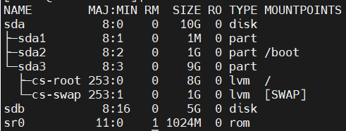
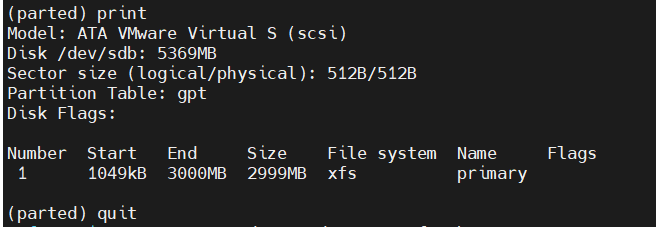
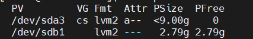
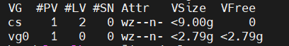
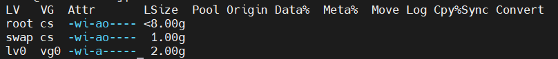
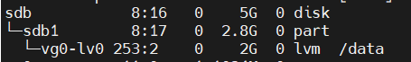
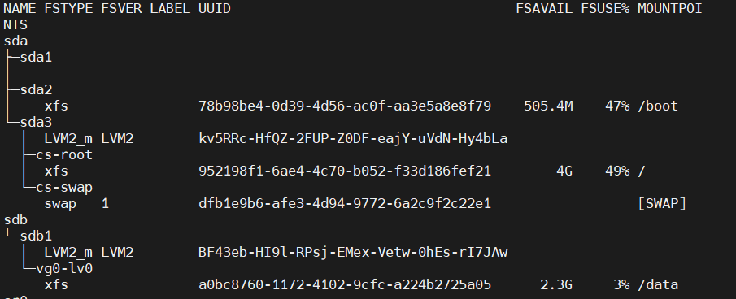
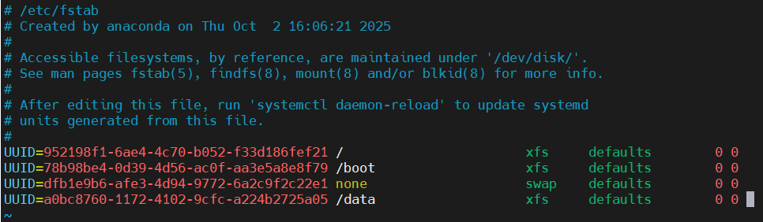

# Lab 1: LVM-Storage-Management

## Objective

- Understand how to manage Linux storage using LVM (Logical Volume Manager).
- Create and manage Physical Volumes (PV), Volume Groups (VG), and Logical Volumes (LV).
- Format and mount a Logical Volume with the XFS filesystem.
- Configure persistent mounting using /etc/fstab.
- Extend an existing Logical Volume and resize the filesystem.
- Practice verifying storage changes using commands like lsblk, df -h, and lvs.


## Steps

  ### 1. display storage devices and partitions
  ```bash
     lsblk
```
 [](images/1.PNG)

 - In this project, we will be working on the /dev/sdb disk to create and manage partitions.

  ### 2. Initialize the disk with a **GPT** partition table.
  ```bash
     parted /dev/sdb
     mklabel Gpt
  ```
  ### 3. Create a **primary** partition.
  ```bash
     mkpart primary xfs 0G 3G
     print
  ```
  [](images/2.PNG)


  ### 4. **Create a Physical Volume (PV)** on the partition. 
  ```bash
   pvcreate /dev/sdb
   pvs
```
  [](images/3 pvs.PNG)

    
 ### 5. **Create a Volume Group (VG)** using the physical volume.

  ```bash
    vgcreate vg0 /dev/sdb
    vgs
  ```
  [](images/4vgs.PNG)

 ### 6. **Create a Logical Volume (LV)** inside the volume group.
  ```bash 
      lvcreate -L 2GB -n lv0 vg0
      lvs
```
  [](images/lvs.PNG)
  

 ### 7. Format the LV0 using the **XFS** filesystem.
  ```bash
       mkfs.xfs /dev/vg0/lv0
  ```

 ### 8. mount
  ```bash
       mount /dev/vg0/lv0  /data
  ```
  [](images/6mount.PNG)

  - We mounted the logical volume using the mount command.
  - This mount is temporary, meaning it will be lost after a reboot.
  
 ### 9. permanent mount
 #### get UUID of logical volume 
  ```bash
       lsblk -f 
  ```
  [](images/-f.PNG)
  #### modify /etc/fstab 
  ```bash
       sudo vim /etc/fstab 
  ```
  [](images/7mount per.PNG)
  ```bash
    mount -a 
  ```
  - to mount /data immediately — no reboot needed.
  - If there’s an error in your /etc/fstab, mount -a will show it, which is great for testing safely.

 ### 10. extend lv
  ```bash
       lvextend -L +500MB /dev/vg0/lv0
  ```
  
  ## Challenges
  ### We created a Logical Volume (LV) using the lvcreate command.
  - The -L option is used to specify the LV size in units like MB or GB (for example: -L 2G).
  - The -l option is used to specify the size in PEs (Physical Extents) instead of GB.
  ### when extend the logical volume
  - If you forget to add the + before the size (for example: -L 1G),
  - it will set the total size to 1 GB, not add 1 GB — effectively overriding the LV size instead of extending it.
