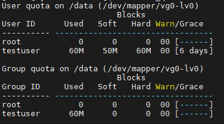
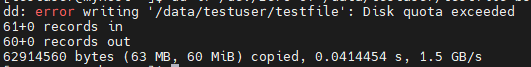

# Lab 2: disk-quota

## Objective

- Understand how to manage and enforce disk usage limits for users and groups.

- Enable and configure user and group quotas on a specific filesystem.

- Modify the /etc/fstab file to permanently activate quota support.

- Initialize quota  and assign limits with xfs_quota tool.

- Monitor and report disk usage using repquota and quota commands.

- Test and verify quota restrictions by exceeding assigned storage limits.

## Steps

  ### 1. Enable Quotas in /etc/fstab.
```bash
     sudo vim /etc/fstab 
```
  #### xfs

- add uquota,gquota
```bash
     UUID=a0bc8760-1172-4102-9cfc-a224b2725a05  /data   xfs   defaults,uquota,gquota      0 0
```

#### ext4
- usrquota,grpquota
```bash
     UUID=a0bc8760-1172-4102-9cfc-a224b2725a05  /data   ext4   defaults,usrquota,grpquota      0 0
```

 

  ### 2. remount /data and reboot.
  ```bash
sudo mount -o remount /data
reboot
```


  ### 3. set quotas .
  #### xfs
  ```bash
     sudo xfs_quota -x -c "limit bsoft=50M bhard=60M testuser" /data
  ```

bsoft = soft limit (warning threshold)

bhard = hard limit (cannot exceed)

#### ext4 
```bash
     sudo edquota -u testuser
```
- then edit be like

```bash
     Filesystem   blocks   soft   hard   inodes   soft   hard
     /dev/sda3       0     50000  60000      0      0      0
```


  ### 4. Verify Quotas.
  #### XFS
  ```bash
 sudo xfs_quota -x -c "report -h" /data
```
[](images/1.PNG)
  #### ext4
  
  ```bash
 sudo repquota /data
```


### 5. Test Quota Enforcement. 

 ```bash
su - testuser
cd ~
dd if=/dev/zero of=/data/testuser/testfile bs=1M count=70
```
- This command creates a 70 MB file full of zeros
- It will stop around 60 MB with “Disk quota exceeded”.


[](images/2.PNG)

## Challenges

- After enabling user and group quotas and performing a remount, the quota limits were not applied immediately.

- The quota configuration only took effect after rebooting the system.


