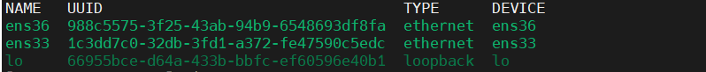
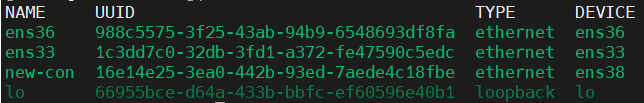
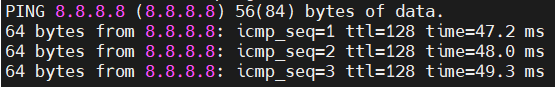
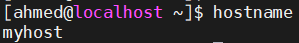
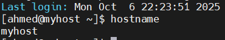

# Lab 3: network-config

## Objective

- Configure and manage network interfaces using nmcli (NetworkManager Command Line Interface).

- Set a static IP address, gateway, and DNS server.

- Modify and activate network connection profiles.

- Verify connectivity using basic network troubleshooting commands (ping, ip, nmcli connection show).

- Configure and persist system hostname across reboots.


## Steps

  ### 1. display network profile .
  ```bash
     nmcli connection show
```
 [](images/1.PNG)

 

  ### 2. add new profile .
  ```bash
     nmcli connection add type ethernet con-name new-con ifname ens38
  ```
 [](images/2.PNG)


  ### 3. Set a static IP address, gateway, and DNS server.
  ```bash
     nmcli connection modify new-con ipv4.address 192.168.112.100/24
     nmcli connection modify new-con ipv4.gateway 192.168.112.1
     nmcli connection modify new-con ipv4.dns 8.8.8.8
     nmcli connection modify new-con ipv4.method manual
  ```
### 4. Activate the new profile. 
  ```bash
sudo nmcli connection up new-con
```


  ### 5. check connectivity. 
  ```bash
   ping -c 3 8.8.8.8
```
  [](images/3.PNG)

    
 ### 5. configure hostname.
#### by hostnamectl command.
  ```bash
    hostnamectl set-hostname myhost
  ```
  [](images/4.PNG)

  - after rebooting
  
  [](images/5.PNG)

#### or  by modifing /etc/hosts file
```bash
    vim /etc/hosts
  ```
- add this line to file :     
  [](images/6hosts.png)

 
  ## Challenges
- After rebooting the machine, it couldn’t access the internet.
- The issue was caused by having multiple active network profiles at the same time, which created conflicting default routes.


