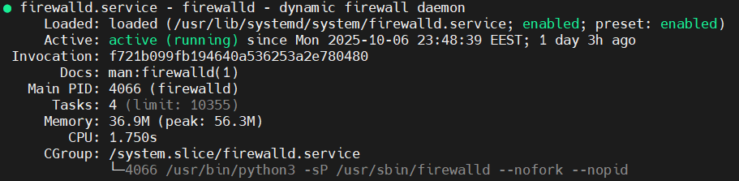

# Lab 4: firewalld-security

## Objective

- Understand and manage firewalld zones and rules.

- Add and remove services and ports using firewall-cmd.

- Configure permanent firewall rules that persist after reboot.

- Assign interfaces to specific zones for better network segmentation.

- Verify and test firewall configurations to ensure network security and service accessibility. 

## Steps

  ### 1. check firewalld status .
  ```bash
     systemctl status firewalld
```
 [](images/1fstop.png)

 

  ### 2. We enabled and started the firewalld service using the following command .
  ```bash
     systemctl enable --now firewalld
  ```
 [](images/2.png)


  ### 3. list firewall zones.
  ```bash
     firewall-cmd --list-all-zones
  ```

  [](images/3.png)

  ### 4. add http service. 
  ```bash
firewall-cmd --permanent --add-service=http
```
  ### 5. remove service. 

 ```bash
firewall-cmd --permanent --remove-service=cockpit
```

  ### 6. add port 8080/tcp. 
  ```bash
   firewall-cmd --permanent --add-port=8080/tcp
```
[](images/4list.png)

- After adding new services or ports to the firewall, we need to reload the configuration to apply the changes . 
```bash
   firewall-cmd --reload 
```
[](images/5rlist.png)


    

 
  ## Challenges

- I forgot to run firewall-cmd --reload after adding new rules,
- so the changes didn’t take effect until I reloaded the firewall configuration.


