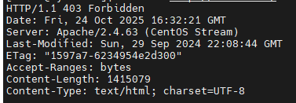
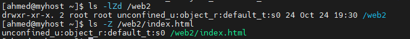
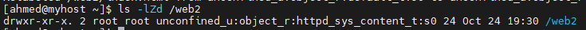
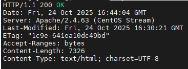
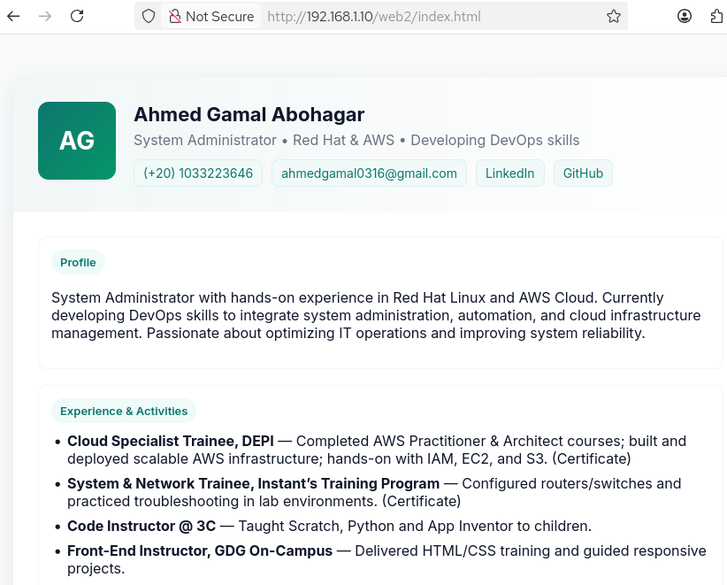

# Lab 5 : SELinux

## Objective

- Understand how SELinux (Security-Enhanced Linux) enforces access control policies on files and services.

- Check the current SELinux mode (enforcing, permissive, or disabled) using getenforce and sestatus.

- Identify and analyze SELinux denials using ls -Z, and log files under /var/log/audit/.

- Troubleshoot service access issues caused by incorrect security contexts.

- Restore proper file contexts using restorecon and permanently fix issues with semanage fcontext.

- Test and verify that services (e.g., Apache) function correctly after applying proper SELinux configurations.

## Steps

  ### 1. make directory and add index.html file then add content to it.

```bash
sudo mkdir /web2
touch /web2/index.html 
```
and add html content to it 
  

  ### 2. make it available via Apache.
  - install apache 
  ```bash
    sudo dnf install httpd -y
  ```
  - enable and run apache 
```bash
    systemctl enable --now httpd
```
  - define /web2 path for Apache
```bash
sudo tee /etc/httpd/conf.d/web2.conf <<'EOF'
Alias /web2 /web2
<Directory /web2>
    AllowOverride none
    Require all granted
</Directory>
EOF
```
- reload httpd to apply changes
 ```bash
systemctl reload httpd
```
- Try accessing it locally.
 ```bash
curl -I http://localhost/web2/index.html
```
 [](images/1.PNG)

 - check SElinux context
  ```bash
ls -ldZ /web2
ls -Z /web2/index.html
```
 [](images/2.PNG)

 context type = default_t and this is problem
 
  ### 3. change SELinux type .
 
```bash
  sudo semanage fcontext -a -t httpd_sys_content_t "/web(/.*)?"
  sudo restorecon -Rv /web
```
- semanage fcontext => permanently define the correct SELinux context ,making it persistent across reboots.
- restorecon -R     => Applying the Label to Files


[](images/3.PNG)

- reTry accessing it locally.
```bash
curl -I http://localhost/web2/index.html
```


  [](images/4.PNG)
  [](images/5.PNG)

## Challenge:

At first, the HTML file placed under /web2 was not accessible through Apache.
When trying to access http://localhost/web2/index.html, it returned 404 Not Found.

### Cause:
Apache did not recognize the /web2 path because it was located outside the default DocumentRoot (/var/www/html).

### Solution:
I created a custom Apache configuration file /etc/httpd/conf.d/web2.conf with an Alias directive to map /web2 to the actual directory path, and allowed access using Require all granted.

```bash
sudo tee /etc/httpd/conf.d/web2.conf <<'EOF'
Alias /web2 /web2
<Directory /web2>
    AllowOverride none
    Require all granted
</Directory>
EOF
```
After reloading Apache, the page became accessible successfully 


