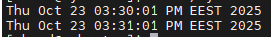
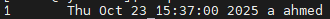
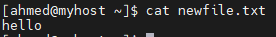
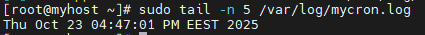
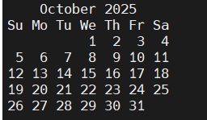

# Lab 6: Scheduled-jobs

## Objective

- Learn how to automate repetitive tasks in Linux using job scheduling tools.

- Configure and manage recurring jobs using cron and system-wide /etc/cron.* directories.

- Schedule one-time jobs using the at command.

- Verify and monitor scheduled jobs using crontab -l, atq, and system logs.

- Understand how to redirect output and errors from scheduled jobs to log files.

- Test, troubleshoot, and remove scheduled jobs effectively

## Steps

  ### create cron job write date in /home/ahmed/mycron.log every minute
- edit crontab

```bash
     crontab -e  
```

- add this line to the file
  
```bash
    * * * * * date >> /home/ahmed/mycron.log
```
- display /home/ahmed/mycron.log content

 
```bash
     cat /home/ahmed/mycron.log
```


 [](images/1.PNG)

 

  ### 2.filter logs related to sshd service .
  ```bash
     journalctl _SYSTEMD_UNIT=sshd.service 
  ```
 [](images/2.PNG)


  ### 3. display last boot logs .
  ```bash
     journalctl -b
  ```

  [](images/3.PNG)

  ### 4. enable persistent logging.
  #### 1. create persistent log directory.
  ```bash
 mkdir /var/log/journal
```
  #### 2. edit journald configuration file 
  
  ```bash
 vim /etc/systemd/jounald.conf
```
 - then add this line
  ```bash
 Storage = persistent
```
#### 3. restart journald service
  ```bash
 systemctl restart systemd-journald
```
#### 4. verfiy it's working 
- If you find log files under /var/log/journal and can view previous boot logs, persistent logging is working correctly.
[](images/4.PNG)

### 5. export specific logs into text file . 

 ```bash
journalctl -u sshd > sshd-logs.txt
cat sshd-logs.txt
```
[](images/5.PNG)


