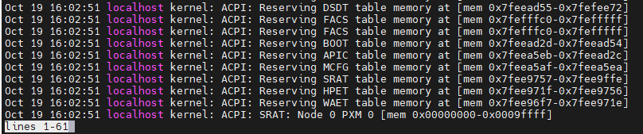
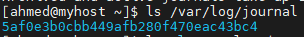
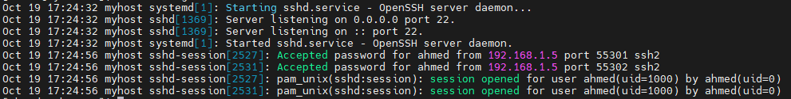

# Lab 7: logs-journal

## Objective

- Understand how to view and analyze system logs using journalctl.

- Filter logs by service, time, or boot session.

- Explore how systemd-journald collects and stores log data.

- Configure persistent logging so logs remain after system reboots.

- Export specific logs (e.g., SSH logs) into a text file for further analysis.

## Steps

  ### 1. display logs .
  ```bash
     journalctl 
```
 [](images/1.PNG)

 

  ### 2.filter logs related to sshd service .
  ```bash
     journalctl _SYSTEMD_UNIT=sshd.service 
  ```
 [](images/2.PNG)


  ### 3. display last boot logs .
  ```bash
     journalctl -b
  ```

  [](images/3.PNG)

  ### 4. enable persistent logging.
  #### 1. create persistent log directory.
  ```bash
 mkdir /var/log/journal
```
  #### 2. edit journald configuration file 
  
  ```bash
 vim /etc/systemd/jounald.conf
```
 - then add this line
  ```bash
 Storage = persistent
```
#### 3. restart journald service
  ```bash
 systemctl restart systemd-journald
```
#### 4. verfiy it's working 
- If you find log files under /var/log/journal and can view previous boot logs, persistent logging is working correctly.
[](images/4.PNG)

  ### 5. export specific logs into text file . 

 ```bash
journalctl -u sshd > sshd-logs.txt
cat sshd-logs.txt
```
[](images/5.PNG)


